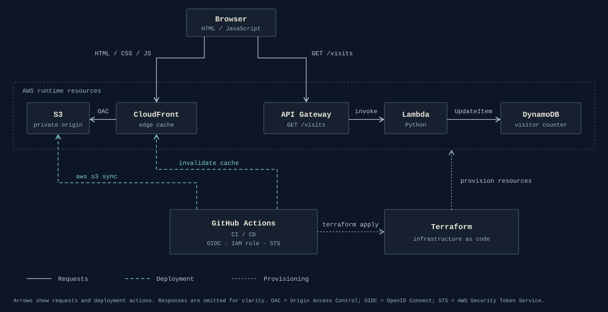

# AWS Cloud Resume Challenge

A serverless resume website deployed on AWS using Infrastructure as Code (Terraform) and CI/CD automation with GitHub Actions.

The project has a static frontend, a serverless visitor counter backend, and an automated deployment pipeline that authenticates to AWS through OIDC federation.

---

## Live Demo

🌐 <https://d12vcl4o8nwstz.cloudfront.net>

---

## Architecture

The browser makes two independent requests: static files from CloudFront, and the visitor counter from API Gateway. Deployment and provisioning are handled separately by GitHub Actions and Terraform.



### Request flow

1. The browser requests the page from CloudFront, which serves HTML, CSS and JS from the private S3 origin.
2. The page then calls `GET /visits` on API Gateway directly. This request does not go through CloudFront.
3. API Gateway invokes the Lambda function, which updates the counter in DynamoDB.

### Deployment flow

Every push to `main` triggers GitHub Actions, which applies Terraform, uploads the site to S3 and invalidates the CloudFront cache. See [CI/CD Pipeline](#cicd-pipeline).

---

## Features

### Static Website Hosting

The frontend is hosted using:

- Amazon S3
- Amazon CloudFront
- CloudFront Origin Access Control (OAC)

The S3 bucket stays private and only CloudFront can read from it. The site is served over HTTPS through CloudFront.

### Serverless Visit Counter

A serverless backend tracks page visits.

```
GET /visits
  |
  v
API Gateway
  |
  v
AWS Lambda
  |
  v
Amazon DynamoDB
```

The Lambda function uses Python and boto3 to update the DynamoDB counter.

Services used:

- Amazon API Gateway HTTP API
- AWS Lambda
- Amazon DynamoDB

---

## Infrastructure as Code

All AWS resources are provisioned and managed with Terraform.

Terraform manages:

- S3 bucket
- CloudFront distribution
- Origin Access Control
- Lambda function
- API Gateway
- DynamoDB table
- IAM roles and policies
- AWS Budget alerts
- GitHub Actions OIDC integration

The infrastructure can be recreated from code without manual configuration in the AWS Console.

---

## CI/CD Pipeline

Every push to the `main` branch triggers an automated deployment pipeline using GitHub Actions.

```
git push
  |
  v
GitHub Actions
  |
  v
AWS authentication using OIDC
  |
  v
Terraform Init
  |
  v
Terraform Validate
  |
  v
Terraform Apply
  |
  v
Frontend deployment to S3
  |
  v
CloudFront cache invalidation
```

The pipeline:

1. Authenticates against AWS using OIDC federation.
2. Obtains temporary AWS credentials through AWS STS.
3. Applies infrastructure changes with Terraform.
4. Uploads frontend changes to S3.
5. Invalidates the CloudFront cache.

---

## Security

### Private S3 Hosting

The S3 bucket is not publicly accessible.

CloudFront accesses S3 using:

- CloudFront Origin Access Control (OAC)
- AWS Signature Version 4

### Secure CI/CD Authentication

No AWS access keys are stored in GitHub. GitHub Actions authenticates with:

```
GitHub Actions
  |
  v
OIDC token
  |
  v
AWS IAM role
  |
  v
Temporary AWS credentials
```

The IAM trust policy restricts access to:

- The specific GitHub repository
- The `main` branch

### IAM Roles

AWS permissions are managed with IAM roles and policies:

- Lambda execution role
- GitHub Actions deployment role
- OIDC federation

---

## Technologies Used

### Cloud

- AWS S3
- AWS CloudFront
- AWS Lambda
- Amazon API Gateway
- Amazon DynamoDB
- AWS IAM
- AWS STS

### Infrastructure

- Terraform
- Terraform AWS Provider

### Development & Automation

- Python
- boto3
- GitHub Actions
- Git
- Linux

---

## Repository Structure

```
.
├── .github/
│   └── workflows/
│       └── deploy.yml
│
├── functions/
│   └── visitor-counter/
│       └── src/
│           └── handler.py
│
├── infra/
│   └── environments/
│       └── prod/
│           ├── api.tf
│           ├── dynamodb.tf
│           ├── lambda.tf
│           ├── github_oidc.tf
│           ├── github_actions_permissions.tf
│           ├── outputs.tf
│           └── versions.tf
│
├── site/
│   └── src/
│       ├── index.html
│       ├── styles.css
│       └── scripts.js
│
└── README.md
```

---

## Deployment

Deployment is fully automated through GitHub Actions.

To deploy a change:

```
git add .
git commit -m "update website"
git push
```

The pipeline deploys the changes to AWS.

---

## Key Learnings

Through this project I implemented:

- Serverless AWS architecture design
- Infrastructure as Code with Terraform
- Secure AWS authentication using OIDC federation
- CI/CD automation with GitHub Actions
- IAM roles and permission management
- Secure static hosting with CloudFront and S3
- Backend development using Lambda, API Gateway and DynamoDB

---

## Future Improvements

- Replace hardcoded deployment values with Terraform outputs consumed by CI/CD.
- Implement stricter IAM least-privilege policies.
- Add automated testing stages.
- Add monitoring and observability using AWS CloudWatch.
- Add a custom domain and SSL certificate using Route 53 and ACM.
